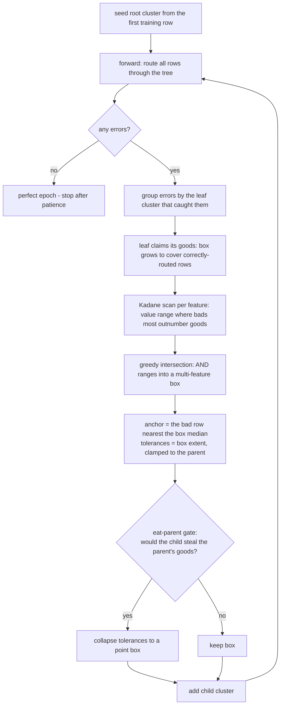

# How it works — one carve, traced end to end

This walks a real training run on a 7-row dataset through every stage of the
algorithm. All numbers below are actual outputs of the code, not
illustrations — you can reproduce them by fitting the dataset yourself with
`verbose=1`.

## The loop



## The dataset

Two features, two classes — class A in the lower-left, class B to the right:

| row | x0 | x1 | class |
|---|---|---|---|
| 0 | 1.0 | 1.0 | A ← seeds the root |
| 1 | 1.5 | 2.0 | A |
| 2 | 2.0 | 1.0 | A |
| 3 | 1.2 | 1.8 | A |
| 4 | 4.0 | 1.0 | B |
| 5 | 4.5 | 2.0 | B |
| 6 | 4.2 | 1.5 | B |

```
epoch 0: errors=3 new_clusters=1 total_clusters=2
epoch 1: errors=0 new_clusters=0 total_clusters=2
epoch 2: errors=0 new_clusters=0 total_clusters=2
epoch 3: errors=0 new_clusters=0 total_clusters=2   <- early stop (3 perfect epochs)
```

One carve fixed everything. Here is what happened inside epoch 0.

## Epoch 0, step by step

### 1. Forward: everything routes to the root

The root cluster is row 0 (`[1.0, 1.0]`, class A) with **infinite tolerance**
— it matches every sample, so the untrained model predicts A for all 7 rows.
The three B rows are errors ("bads"); the four A rows are "goods".

Everything from here on works in **diff space**: each row expressed as its
offset from the anchor of the cluster that caught it (the root, `[1, 1]`):

```
bad diffs  (rows 4-6):  [3.0, 0.0]  [3.5, 1.0]  [3.2, 0.5]
good diffs (rows 0-3):  [0.0, 0.0]  [0.5, 1.0]  [1.0, 0.0]  [0.2, 0.8]
```

### 2. The parent claims its goods

Before carving, the root's infinite tolerance collapses to exactly the
envelope of its good diffs: lower `[0, 0]`, upper `[1, 1]` — i.e. the box
from `[1, 1]` to `[2, 2]` in absolute terms. The parent now *owns* precisely
the territory it classifies correctly; children get sized against that
settled box.

### 3. Kadane scan: which feature separates the errors?

For each feature, put the bad and good values on a number line and run a
max-subarray scan on the running (bads − goods) count:

| feature | best range | B | G | net = B − G |
|---|---|---|---|---|
| **x0** | **[3.0, 3.5]** | **3** | **0** | **3** |
| x1 | [0.5, 0.5] | 1 | 0 | 1 |

Feature x0 is decisive: all three bad diffs (3.0, 3.2, 3.5) sit far from
every good diff (0.0–1.0), so the range `[3.0, 3.5]` captures 3 bads and 0
goods. Feature x1 is nearly useless — its value line interleaves bads and
goods:

```
value:  0.0   0.5   0.8   1.0
bads:    1     1     0     1
goods:   2     0     1     1
score:  -1    +1    -1     0     -> best subarray: [0.5, 0.5], net 1
```

### 4. Family intersection: try to AND features together

The scan ranks features `[x0 (net 3), x1 (net 1)]`. The family starts as
x0's box (3 bads, 0 goods, net 3), then tries adding x1: restricted to the
family's rows, x1's best range `[0.5, 0.5]` would keep only 1 bad — net
drops from 3 to 1, so **x1 is rejected**. The family stays single-feature:
`x0 ∈ [3.0, 3.5]`, and the child's feature mask will be `[1, 0]`.

(This greedy AND is the whole point of the stage: when single features are
individually weak but jointly strong, the intersection can reach a positive
net that no single feature has.)

### 5. Anchor and tolerances

The anchor is the *actual bad row* closest (L1) to the family's median diff.
Median of `{3.0, 3.5, 3.2}` on x0 and `{0.0, 1.0, 0.5}` on x1 is
`[3.2, 0.5]` — exactly row 6's diff, so **row 6 `[4.2, 1.5]` becomes the
child's anchor** (distance 0). Tolerances on the selected feature are the
family's extent around the anchor (plus a tiny floor, ~1e-7):

```
lower: 3.2 - 3.0 = 0.2      upper: 3.5 - 3.2 = 0.3
```

so the child's box on x0 is `[4.0, 4.5]` in absolute terms — precisely the
span of the three B rows.

### 6. The eat-parent gate

Before committing, simulate routing for the parent's four good diffs: would
any of them now score higher with the child than with the parent? The
child's box starts at x0-diff 3.0; the goods sit at 0.0–1.0, hopelessly far
outside — the parent keeps all 4, the gate stays silent. (Had the child's
box swallowed the parent's population, its tolerances would have been
collapsed to a point box around the anchor.)

### 7. Commit

The box holds B=3 bads, G=0 goods. B > G means a clean separation, so the
child takes the **bads' label (B)** — and from the child's own viewpoint
those 3 captured rows are its *goods* (it classifies them correctly), giving
confidence 3/3 = 1.0:

```
cluster 1: anchor=[4.2, 1.5], label=B, mask=[1 0],
           atol lower=[0.2, 0], upper=[0.3, 0], parent=0, conf=1.00
```

### 8. Epoch 1: fixed

On the next forward pass the three B rows reach the root, then face the
root-vs-child competition. They fall inside the child's x0 box (score 1.0)
while scoring low with the parent — they descend and predict B. Zero errors;
after three consecutive perfect epochs, training stops.

## Routing a new sample

`[4.1, 1.2]` — never seen in training:

```
path: [0, 1]   ->   prediction: B  (confidence 1.00)
```

Root competition → root; descent → x0 = 4.1 is inside the child's
`[4.0, 4.5]` box → child wins → label B. The "explanation" of this
prediction is concrete: *it matched the cluster anchored on training row
`[4.2, 1.5]`, on feature x0, within [-0.2, +0.3] of the anchor.*

## Where each stage lives

| Stage | Code |
|---|---|
| routing / competitions | [tree.py](../hypothesis_tree/tree.py), [matching.py](../hypothesis_tree/matching.py) |
| error grouping, parent-claims-goods, carve loop | [refinement.py](../hypothesis_tree/refinement.py) |
| Kadane scan + family intersection | [scoring.py](../hypothesis_tree/scoring.py) |
| anchor/tolerances + eat-parent gate | [carving.py](../hypothesis_tree/carving.py) |

Real datasets exercise the paths this tiny example skips: multi-feature
families (step 4 accepting candidates), the gate firing (step 6), and
"ambiguity carves" — when a box traps more goods than bads, the child keeps
the parent's label with reduced confidence instead of flipping.
